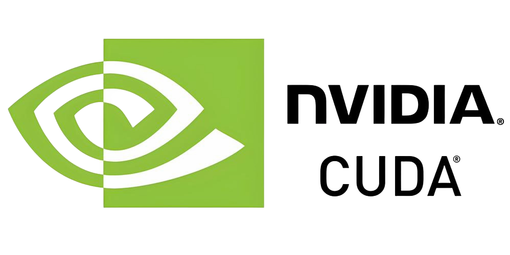
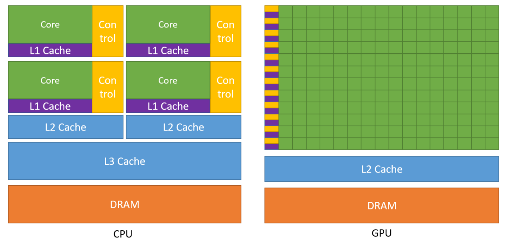

# GPU-Perf-Playground (GPP)

> 一个面向初学者的 **GPU 性能与 AI Infra 学习项目**：从 CUDA 算子、性能工具，到推理框架、训练框架和并行架构，通过 29 个最小增量 Ticket 逐步掌握。

> 📝 本项目是我基于本地设备（RTX 4070 Laptop / WSL2）**边实现边学习**的学习笔记与实践记录；方案已按 **29 个增量 Ticket** 划分，你可以根据自己的需求和设备配置**修改、增删、调整顺序**，不必完全照搬。

<p align="center">
  <a href="https://github.com/yanght24/GPU-Perf-Playground/stargazers">
    
  </a>
  <a href="https://github.com/yanght24/GPU-Perf-Playground">
    
  </a>
  
  
</p>

<p align="center">
  
</p>

> 项目定位：不是“一次性实现完给你看对比”，而是 **实现 → 讲解 → 覆盖检查 → 过关 → 学习者验收 → 下一增量** 的闭环学习项目。

---

## 目录

- [项目贡献与特点](#项目贡献与特点)
- [学习路线](#学习路线)
- [仓库结构](#仓库结构)
- [快速开始](#快速开始)
- [Ticket 地图](#ticket-地图)
- [推理/训练快速使用](#推理训练快速使用)
- [文档](#文档)
- [贡献](#贡献)
- [开源说明](#开源说明)
- [状态](#状态)
- [Star History](#star-history)
- [License](#license)

---

## 项目贡献与特点

- 📚 **29 个最小增量**：T00–T28，从零基础到 AI Infra 全链路。
- 🔧 **五路径算子**：PyTorch / CUDA C++ / Triton / cuTile / CuTe DSL 横向对比。
- 📊 **工具取证**：NCU、NSYS、SASS 原生命令与证据。
- 🚀 **推理框架实战**：vLLM、SGLang、TensorRT-LLM、ms-swift。
- 🎓 **训练框架实战**：PyTorch、DeepSpeed、ms-swift SFT/LoRA。
- 🧩 **并行架构**：DP/DDP/ZeRO/FSDP/TP/PP/SP/CP。
- ✅ **可复现**：每个 Ticket 都有 `scripts/` 一键复现。
- 📝 **讲义双写**：对话讲解同步落盘到 `docs/lectures/Txx-*.md`。
- 🧭 **框架使用导向**：不只讲原理，更讲“怎么启动、怎么发请求、怎么测指标、怎么对比”。

<p align="center">
  
</p>

---

## 学习路线

### 🐣 新手村：环境与算子基础
- T00：环境、快照、证据门禁
- T01–T03：Vector Add、ReLU
- T04–T08：GEMM 从朴素到 Tensor Core

### ⚔️ 进阶：访存、归约与 Attention
- T09–T10：Transpose
- T11–T12：Reduction
- T13–T14：Softmax
- T15–T18：Attention、KV Cache、FlashAttention

### 🚀 模型/推理框架实战
- T19：Transformers 基线
- T20–T23：vLLM / SGLang / TensorRT-LLM / ms-swift
- T24：推理统一对比

### 🎓 训练框架实战
- T25：PyTorch 最小训练
- T26：DeepSpeed + ZeRO
- T27：ms-swift SFT/LoRA
- T28：并行架构对比

> 每个 Ticket 的完整讲义在 `docs/lectures/`，任务书在 `docs/tickets/`。

---

## 仓库结构

```text
docs/
  tickets/Txx-*.md              # 29 个任务书
  lectures/Txx-*.md             # 每轮唯一主讲义
  CONCEPTS.md                   # 核心概念词典
environments/                   # conda/容器环境门禁脚本
scripts/                        # 一键复现脚本
src/                            # 算子/框架实现
```

---

## 快速开始

### 1. 环境

项目使用 conda 环境和 Docker 容器：

```bash
# 查看环境
conda env list

# 环境门禁
bash environments/gpp-core.sh --verify-only
bash environments/gpp-cute.sh --verify-only
bash environments/gpp-cutile.sh --verify-only
bash environments/gpp-deepspeed-0.19.5.sh --verify-only
bash environments/gpp-swift-4.4.3.sh --verify-only
bash environments/containers.sh --verify-only
```

### 2. 从 T00 开始

```bash
# 阅读 T00 任务书
cat docs/tickets/T00-day0.md
```

### 3. 一键复现某个 Ticket

```bash
# 例如 T01 Vector Add
bash scripts/run_t01_all.sh > docs/evidence/T01/t01-run-all.txt 2>&1

# T19 Qwen 基线
bash scripts/run_t19_all.sh > docs/evidence/T19/t19-run-all.txt 2>&1
```

---

## Ticket 地图

| 阶段 | Ticket | 内容 |
| --- | --- | --- |
| 准备 | T00 | Day0：环境、快照、证据门禁 |
| 算子 | T01–T03 | Vector Add、ReLU 标量/向量化 |
| GEMM | T04–T08 | 朴素/Tiling/SMEM/Pipeline/Tensor Core |
| 访存/协作 | T09–T14 | Transpose、Reduction、Softmax |
| Attention | T15–T18 | 朴素 Attention、KV Cache、FlashAttention |
| 模型/推理 | T19–T24 | Transformers 基线、vLLM、SGLang、TRT-LLM、ms-swift、统一对比 |
| 训练 | T25–T27 | PyTorch、DeepSpeed、ms-swift SFT/LoRA |
| 并行 | T28 | DP/DDP/ZeRO/FSDP/TP/PP/SP/CP |

完整任务书见 `docs/tickets/`，完整讲义见 `docs/lectures/`。

---

## 推理/训练快速使用

### 推理框架

```bash
# vLLM
bash scripts/run_t20_all.sh > docs/evidence/T20/t20-run-all.txt 2>&1

# SGLang
bash scripts/run_t21_all.sh > docs/evidence/T21/t21-run-all.txt 2>&1

# TensorRT-LLM
bash scripts/run_t22_all.sh > docs/evidence/T22/t22-run-all.txt 2>&1

# ms-swift 推理
bash scripts/run_t23_all.sh > docs/evidence/T23/t23-run-all.txt 2>&1

# 统一对比
conda run --no-capture-output -n gpp-core python -I \
  src/t24_inference_compare/compare_frameworks.py
```

### 训练框架

```bash
# PyTorch 最小训练
bash scripts/run_t25_all.sh > docs/evidence/T25/t25-run-all.txt 2>&1

# DeepSpeed
bash scripts/run_t26_all.sh > docs/evidence/T26/t26-run-all.txt 2>&1

# ms-swift SFT/LoRA
bash scripts/run_t27_all.sh > docs/evidence/T27/t27-run-all.txt 2>&1
```

---

## 文档

- **任务书**：`docs/tickets/T00–T28`
- **讲义**：`docs/lectures/T00–T28`
- **概念词典**：`docs/CONCEPTS.md`

---

## 贡献

欢迎 PR、Issue 和 Star ⭐：

- 🐛 发现错误或命令跑不通 → 提 Issue；
- 📝 补充讲义、修正错别字、增加示例 → 提 PR；
- 🧪 在真实 GPU 上复跑并补充证据 → 提 PR；
- 💡 有好的学习主题或面试题 → 提 Issue 讨论。

> 保持项目“面向初学者、可复现、官方对齐”的原则即可。

---

## 开源说明

- 模型与数据集来自 ModelScope 固定 revision。
- 第三方组件许可见 `THIRD_PARTY_NOTICES.md`。
- 本项目用于学习和教学，不保证生产级性能。

---

## 状态

- T00–T28 已验收，课程主线闭环。
- 多卡并行实测标 C，恢复路径已写在 T28 讲义。
- 后续可补多卡证据、新框架调研或复习。

---

## Star History

[](https://star-history.com/#yanght27/GPU-Perf-Playground&Date)

---

## License

见 `LICENSE`。
